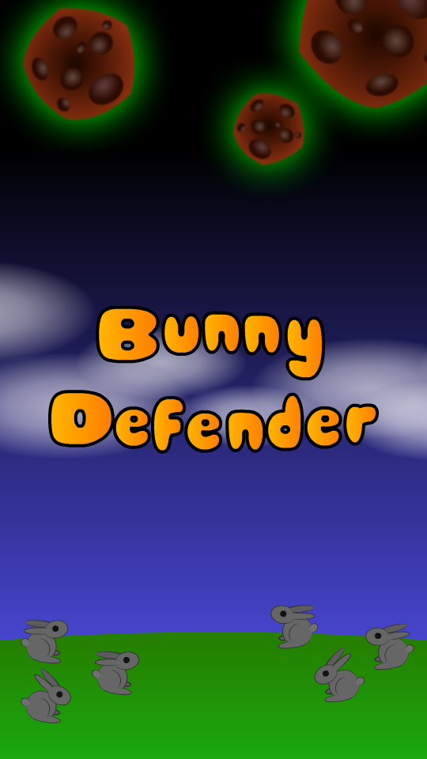

# Bunny Defender
## About
Bunny Defender is a RPG Game designed using Phaser, HTML, and JavaScript.

## Snapshot



## Built With

- Javacript
- HTML
- CSS
- Webpack
- npm
- Phaser 3

## Live Demo

[Live Demo Link]( )


## Getting started
To get started:

### Clone the repo: 
```
$ git clone https://github.com/gango-anan/bunny-defender.git

```

## Setup and run the application
### Install node.js:
```
First install node.js for your system
```
### Next, navigate to the project folder and install other dependencies using the following command:
```
$ npm install
```

## Run 
```
Run the application by launching your local webserver and lauching the index.html file in the browser
http://127.0.0.1:5500/dist/index.html
```
## Author

Galiwango Ananiya

- GitHub: [@gango-anan](https://github.com/gango-anan) 
- Twitter: [@gango_anan](https://twitter.com/gango_anan) 
- LinkedIn: [@galiwango-ananiya](https://www.linkedin.com/in/galiwango-ananiya-0800821b4/) 

## 🤝 Contributing

Contributions, issues, and feature requests are welcome!

Feel free to check the [issues page](https://github.com/gango-anan/bunny-defender/issues).

## Show your support

Give a ⭐️ if you like this project!

## Acknowledgments
- Phaser Team.
- FreeCodeCamp


## 📝 License

This project is [MIT](https://github.com/gango-anan/bunny-defender/blob/master/LICENSE) licensed.
