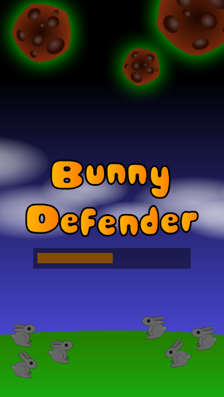
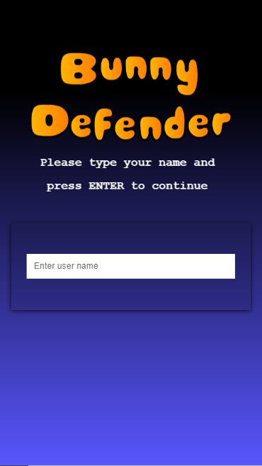
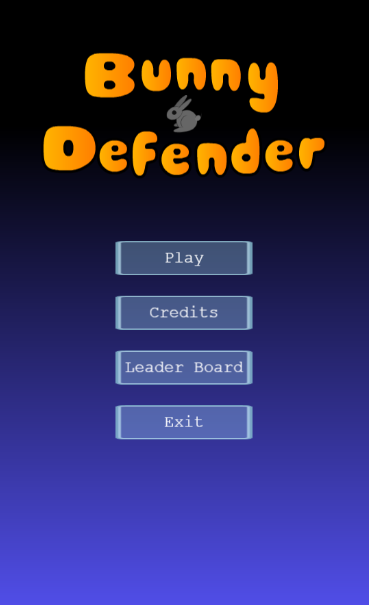
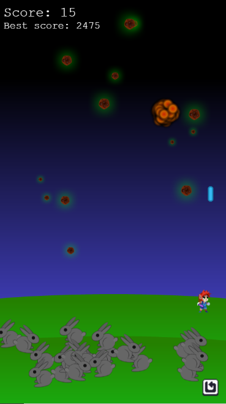
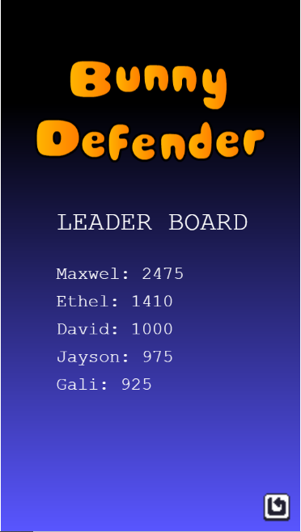

# Bunny Defender
## About
Bunny Defender is a RPG Game designed using Phaser, HTML, JavaScript, and a API to store the game scores on a remote server. It's a game based on a farmer protecting his bunnies from being hunted down by hunters(space rocks). The Farmer(game player) keeps shooting down the space rocks pelted by the hunters to try and prevent them from hitting his bunnies. Once a rock hits a bunny it dies, it's ghost ascends upwards back to its creator and that bunny is lost forever to the hunter. Each time the farmer(player)successfully intercepts a space rock, the player gets 5 points which are accumulated as the game carries on till the end. 
At the end of the game the players scores along with the user name are save on the remote server.
A player can always check on the Leaders Board to see how he/she is fairing.

## Game Loading


## Capture player's name


## Menu scene


## Game Scene


## Leader Board Scene



## Built With

- Javacript
- HTML
- CSS
- Webpack
- npm
- Phaser 3

## Live Demo

[Live Demo Link](https://angry-mcnulty-4774f2.netlify.app/)

## prerequisite
You must have a live internet connection before you get started.

## Getting started
To get started:

### Clone the repo: 
```
$ git clone https://github.com/gango-anan/bunny-defender.git

```

## Setup and run the application
### Install node.js:
```
First install node.js for your system
```
### Next, navigate to the project folder and install other dependencies using the following command:
```
$ npm install
```

## Tests 
```
Run the tests using the following command in the terminal
$ npm run test

```

## Launching the web server
```
Once all the tests have passed, you can now lauch the local webserver using the following command
$ npm run start

```

## Running the Game
```
You can now run the game by opening your browser and type in

localhost:8080

```

## Instructions to play the Game.
- The game store the scores on on a remote server soo INTERNET CONNECTION is a must have before you get started.
- Once the game is fully loaded, provide your name and press the ENTER key to continue.
- Once you have provided your name, you will be redirected to the MENU screen with the game launch options.
- Choose the appropriate action you would like to take and click on it.
- Use the SPACE KEY to shoot the space rocks, each time you shoot a rock you receive 5 points.
- USE the RIGHT ARROW KEY on your keyboard to move to the RIGHT, and
- LEFT ARROW KEY on your keyboard to move to the left.
- You reduce you game life each time a bunny is hit by a space rock.
- At any one time if you wish to return to the menu screen, click on the return button in the lower right hand corner of the screen.
- When the game is over your score will be automatically saved to the remote server.
- You can take a look at the LEADER BOARD to see the top scorers.


## Author

Galiwango Ananiya

- GitHub: [@gango-anan](https://github.com/gango-anan) 
- Twitter: [@gango_anan](https://twitter.com/gango_anan) 
- LinkedIn: [@galiwango-ananiya](https://www.linkedin.com/in/galiwango-ananiya/) 

## 🤝 Contributing

Contributions, issues, and feature requests are welcome!

Feel free to check the [issues page](https://github.com/gango-anan/bunny-defender/issues).

## Show your support

Give a ⭐️ if you like this project!

## Acknowledgments
- Phaser Team.
- FreeCodeCamp


## 📝 License

This project is [MIT](https://github.com/gango-anan/bunny-defender/blob/master/LICENSE) licensed.
